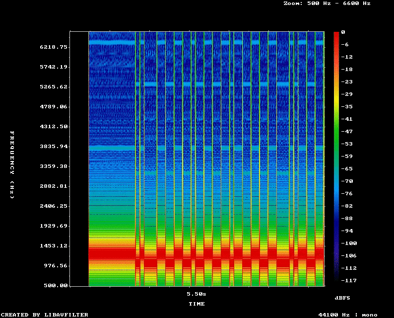

# HydroModem: Underwater Bell 103 modem implementation for low-power microcontrollers

Main project page: https://waynepiekarski.net/projects/hydro-modem.htm

This is an implementation of a Bell 103 modem decoder for Arduino devices with
low-power microcontrollers such as atmega328p. It uses a simple Goertzel algorithm
to detect the power of two frequencies, compares them to determine mark-space bits,
and then decodes these into 8-bit characters. This method can handle background noise
and is used here to implement an acoustic underwater data transmit/receive mechanism.
Low-power devices can be permanently placed underwater, listening for a wakeup message,
and then take some kind of action like burn a nichrome wire for an acoustic release.
It is expected that the modem will run on its own atmega328p since there is no time remaining,
and a co-processor like another atmega328p will listen to the decoded characters and take action.

This implementation supports a 2600 Hz sample rate on an atmega328p at 16 MHz. Transmission
is with sine wave tones at 1070 Hz and 1270 Hz. The sample rate must be at least double the highest frequency
(Nyquist theorem) and during testing at low signal strength some sample rates were found to be more reliable than
others due to aliasing. This implementation supports up to 3300 Hz, but beyond that requires a higher clock
rate on the microcontroller, possibly using something like an ESP32S3. The input is read
in via the Arduino ADC, which needs to be able to capture samples at the frequency required.

The atmega328p must be run at 16 MHz for 2600 Hz sample rate, requires at least 4.0V for this clock speed according to the datasheet,
and will draw 7 mA current or 0.028 W power. This is 1-2 orders of magnitude better than a Raspberry Pi running Linux, and capable
of running for weeks/months on a battery underwater.

Sample audio generated by the modem tests:
[](sample/spectrogram-44100-1cps.mp4?raw=1)

# Arduino Uno 16MHz on Linux command-line
```
# Download arduino-cli (run once)
./download-arduino-tools

# Download arduino libraries (run once)
./download-arduino-libs

# Build and upload the modemrx project via USB serial
make -C modemrx upload

# Read characters decoded from the modemrx project
make -C modemrx read
```

The modemrx.ino project can also be loaded into the Arduino IDE on any supported platform.

# Generate modem audio samples
[web-transmit/web-bell103-encoder.html](web-transmit/web-bell103-encoder.html) is a HTML5 sample to generate audio.
This sample is also available at https://waynepiekarski.net/projects/hydro-modem.htm to use on a mobile phone and
can transmit the audio via Bluetooth or a headphone jack to a hydrophone transmitter underwater.

# Listen and record audio on Linux via Arduino ADC
```
# Download arduino-cli (run once)
./download-arduino-tools

# Download arduino libraries (run once)
./download-arduino-libs

# Build and upload the recordwav project via USB serial to record from the ADC
make -C recordwav upload

# Save audio to disk for offline testing, adjust gain and center for SparkFun SPH8878 microphone
./recordwav/save_arduino_sparkfun_sph8878.sh

# Listen to live audio on speakers, adjust audio gain and center for SparkFun SPH8878 microphone
./recordwav/live_arduino_sparkfun_sph8878.sh
```

# Linux testing of modem
```
# Download Debian/Ubuntu dependencies (run once)
./linux-test/apt-get-deps

# Build Linux binaries
make -C linux-test

# Generate WAV files using test strings
./linux-test/bell103_goertzel_wav_encoder

# Decode WAV files and recover test strings
./linux-test/bell103_goertzel_wav_decoder

# Run test suite that verifies encoding and decoding at various sample rates.
make -C linux-test test
```

Tests also verify that HydroModem's Bell 103 encoding is compatible with http://www.whence.com/minimodem/ on Linux.

# Connecting a microphone or hydrophone

This is currently the software needed to read audio from the ADC pin on an Arduino Uno. Currently it is easiest
to test by connecting a microphone like the SparkFun SPH8878 and testing it in air listening to the sample audio
from a phone transmitter. Once this is working, you then need to connect a hydrophone to the ADC pin. The design
of a suitable hydrophone and how to connect it is future work. Make sure that your microphone does not exceed the
voltage specs of the Arduino ADC.

Future work is to provide a circuit schematic and PCB layout for a custom dual atmega328p design with input from a piezo microphone.

# License

HydroModem: Underwater Bell 103 modem implementation for low-power microcontrollers

Copyright (C) 2024-2025 Wayne Piekarski wayne@tinmith.net

https://waynepiekarski.net/projects/hydro-modem.htm

This program is free software: you can redistribute it and/or modify
it under the terms of the GNU General Public License as published by
the Free Software Foundation, either version 3 of the License, or
(at your option) any later version.

This program is distributed in the hope that it will be useful,
but WITHOUT ANY WARRANTY; without even the implied warranty of
MERCHANTABILITY or FITNESS FOR A PARTICULAR PURPOSE.  See the
GNU General Public License for more details.

You should have received a copy of the GNU General Public License
along with this program.  If not, see <http://www.gnu.org/licenses/>.